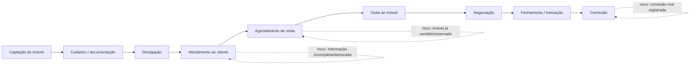

# DOMUS — Mapa de jornada do corretor de imóveis

## Objetivo

Visualizar o ciclo completo de trabalho do corretor, da captação do imóvel até o recebimento
da comissão, marcando em cada etapa: o que ele faz, quais ferramentas usa, onde perde tempo
ou comete erro, e como isso se conecta com o que a entrevista/formulário já revelaram. Serve de
evidência visual para a Seção 1 (como o problema ocorre na prática) e para justificar o escopo
da solução na Seção 3/4 do diagnóstico.

## Como preencher

Uma linha por etapa da jornada. Preencher com base na entrevista já feita com o corretor-persona;
se possível, validar/ajustar acompanhando (mesmo que por chamada) um atendimento real dele.
Onde houver dado numérico da entrevista/formulário, citar (ex.: "5h/semana", "70% via WhatsApp").

## Etapas da jornada

| # | Etapa | O que o corretor faz | Ferramenta/meio usado hoje | Ponto de dor / risco | Dado de apoio (entrevista/formulário) |
|---|-------|----------------------|------------------------------|------------------------|----------------------------------------|
| 1 | Captação do imóvel | Visita o imóvel, coleta dados do proprietário, tira fotos | — | — | — |
| 2 | Cadastro/documentação | Registra o imóvel e status (disponível/reservado/vendido/pendente) | — | — | — |
| 3 | Divulgação | Publica o imóvel em portais/redes | — | — | — |
| 4 | Atendimento ao cliente | Responde interesse, envia informações do imóvel | — | — | — |
| 5 | Agendamento de visita | Confirma disponibilidade do imóvel e do cliente | — | — | — |
| 6 | Visita ao imóvel | Acompanha o cliente presencialmente | — | — | — |
| 7 | Negociação | Trata proposta, condições, documentação | — | — | — |
| 8 | Fechamento/transação | Formaliza venda/locação | — | — | — |
| 9 | Comissão | Registra e acompanha recebimento da comissão | — | — | — |

*(preencher cada célula "—" com o que a entrevista trouxe; deixar em branco só o que ainda não
foi validado, e marcar como pendência para a próxima rodada de coleta)*

## Diagrama (visão geral do fluxo)

*(os pontos tracejados marcam onde a entrevista/formulário indicaram maior risco de erro ou
perda — ajustar/adicionar conforme os dados coletados confirmarem outros pontos)*

## Como usar no diagnóstico

- **Seção 1**: cada "ponto de dor" da tabela vira um parágrafo de "como o problema ocorre na
  prática", já com frequência/tempo trazidos da entrevista ou do formulário.
- **Seção 3**: as etapas com mais risco (ex.: agendamento de visita, comissão) indicam onde a
  solução precisa focar primeiro — reforça a justificativa de escopo.
- **Seção 6 (Anexos)**: o diagrama (ou uma versão desenhada à mão/Figma a partir dele) pode
  entrar como imagem do "esboço" pedido no modelo.
